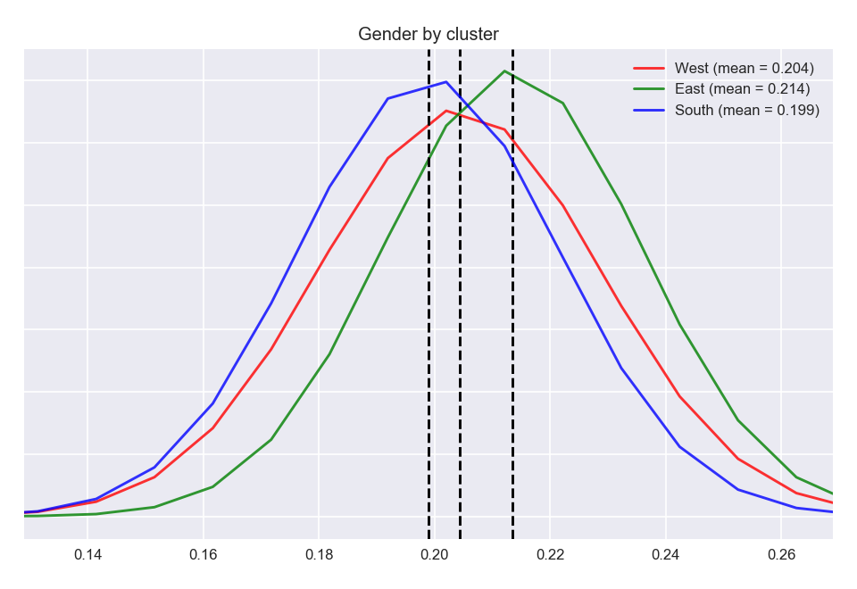

# compelling title
#### Capstone I for Galvanize Data Science Immersive

## Data
The data were collected through [the Moral Machine](http://moralmachine.mit.edu/), an online game created by MIT researchers. Users decide the morally preferable action for an autonomous vehicle from two scenarios presented by the game. Each game session is 13 choices long. At the end of the sessions, the user has the option to provide demographic information including their age, gender, annual income, country, and political and religious orientation on a sliding scale. 

An example of a choice on the Moral Machine.


Moral Machine data are publicly [available](https://osf.io/3hvt2/?view_only=4bb49492edee4a8eb1758552a362a2cf). Nonetheless, the column names are fairly cryptic and understanding them required parsing the code in the project repository.
```
ScenarioOrder,Intervention,PedPed,Barrier,CrossingSignal,AttributeLevel,ScenarioTypeStrict,ScenarioType,
DefaultChoice,NonDefaultChoice,DefaultChoiceIsOmission,NumberOfCharacters,DiffNumberOFCharacters,Saved,Template,
DescriptionShown,LeftHand

13,0,0,0,0,Female,Gender,Gender,Male,Female,0,2,0,1,Desktop,0,0
```

Each row of the data represents either panel of each scenario. For the right panel in the image above:
```
Intervention = 0
PedPed = 1 // A choice between two groups of pedestrians
Barrier = 0
CrossingSignal = 1 // The character spared is crossing legally, 0 means there is no crossing signal
AttributeLevel = Hooman
ScenarioType = Species
DefaultChoice = Hoomans
NonDefaultChoice = Pets
DefaultChoiceIsOmission = 0 // Choosing the default choice does not require the car to change course
NumberOfCharacters = 1
DiffNumberOFCharacters = 0 // The number of characters killed is consistent no matter the choice
Saved = 1 // I choose the right panel
DescriptionShown = 0
LeftHand = 0
```

## Question

The authors of the Moral Machine paper found, fairly unsurprisingly, that there were some strong global preferences for saving humans over animals, more people over fewer, and the young over the old.

They then 
 

## Method

Unlike a classic [trolley problem](https://en.wikipedia.org/wiki/Trolley_problem), which is a choice between intervention and the utilitarian desire to save the most lives, choices on the Moral Machine have numerous dimensions. The authors of the paper used a conjoint analysis to calculate the effect of each factor in a user's choice. Replicating this analysis was beyond the scope of my project (read: "Their math is way over my head").

My approach was to take 

## Results




P-values for 
<p align="center">
<b>|       |    West |    East |   South |
|-------|---------|---------|---------|
| West  | -       | 0.83088 | 0.48091 |
| East  | 0.83088 | -       | 0.53105 |
| South | 0.48091 | 0.53105 | -       |</b>
</p>

## Spark Efficiency


## Takeaways

## References
* MIT Technology Review [link to article](https://www.technologyreview.com/s/612341/a-global-ethics-study-aims-to-help-ai-solve-the-self-driving-trolley-problem/?utm_medium=tr_social&utm_campaign=site_visitor.unpaid.engagement&utm_source=Twitter#Echobox=1576511368 "Should a self-driving car kill the baby or the grandma? Depends on where you’re from.")
* Nature [link to paper](https://www.nature.com/articles/s41586-018-0637-6.epdf?referrer_access_token=5SBKjXqSe9W89TIoohZIvNRgN0jAjWel9jnR3ZoTv0OR8PKa5Kws8ZzsJ9c7-2Qpul1Vc1F8wY0eIbuOUfmConm9MpvB9JNjnmyrCoj2uOCRbTFI3tmUdV2tYqE2L6ifmrb-tsgAoOc9lINEcKDSOkEkmhLSjqz8bf1ACffMhu6EiQ2ZXU5cHbrFXuiJoXRMxuojb8tUZNFuN2R4kksBNzsaFxxkByF7rx-cxTgMCGvimdjBOY0vMtRkwpXvk9EyI0NunRjTj6Bi1No-Hv00gQBUqxE6xdxW_2lzO7zwdeMnyED_zlEwNHFqcd9GAeuWl-CtPy9UtgwYO_5VKTLt50rGC5vG2pcPQsAXVtbF58CCLdPZcJHGJit56_0t8-lq0fjzKjPGd6HBGyxlP6-5HpLh6sV0tO9TjZmLkIKUVFKNZPjEb8N5_Ysqk0IbycCC&tracking_referrer=www.technologyreview.com "The Moral Machine Experiment")

