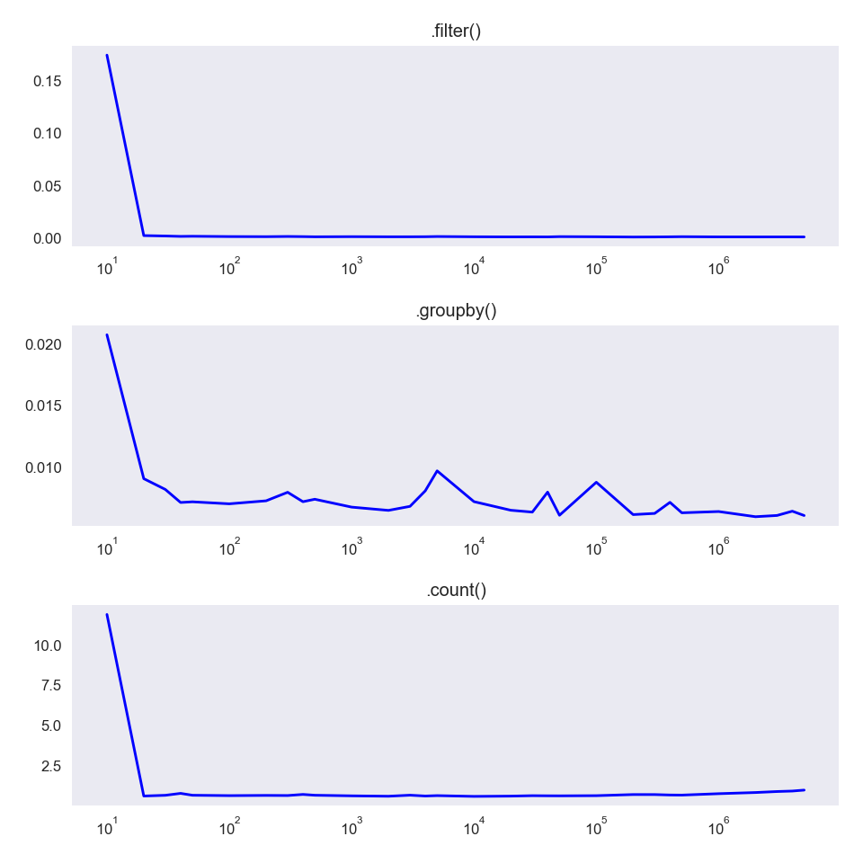

# Does geography determine moral preferences?

Paxton Hyde

Galvanize Data Science Immersive Capstone 1, January 2020

## Content
- [Context](#context)
- [Results](#results)
- [Takeaways](#takeaways)
- [Spark](#spark-efficiency)
- [References](#references)
## Context
### Data
The data were collected through [the Moral Machine](http://moralmachine.mit.edu/), an online game created by MIT researchers. Users decide the morally preferable action for an autonomous vehicle from two scenarios presented by the game. Each game session is 13 choices long. At the end of the sessions, the user has the option to provide demographic information including their age, gender, annual income, country, and political and religious orientation on a sliding scale. 

An example of a choice on the Moral Machine.


Moral Machine data are publicly [available](https://osf.io/3hvt2/?view_only=4bb49492edee4a8eb1758552a362a2cf). Nonetheless, the column names are fairly cryptic and understanding them required parsing the code in the project repository.
```
ScenarioOrder,Intervention,PedPed,Barrier,CrossingSignal,AttributeLevel,ScenarioTypeStrict,ScenarioType,
DefaultChoice,NonDefaultChoice,DefaultChoiceIsOmission,NumberOfCharacters,DiffNumberOFCharacters,Saved,Template,
DescriptionShown,LeftHand

13,0,0,0,0,Female,Gender,Gender,Male,Female,0,2,0,1,Desktop,0,0
```

Each row of the data represents either panel of each scenario. For the right panel in the image above:
```
Intervention = 0
PedPed = 1 // A choice between two groups of pedestrians
Barrier = 0
CrossingSignal = 1 // The character spared is crossing legally, 0 means there is no crossing signal
AttributeLevel = Hooman
ScenarioType = Species
DefaultChoice = Hoomans
NonDefaultChoice = Pets
DefaultChoiceIsOmission = 0 // Choosing the default choice does not require the car to change course
NumberOfCharacters = 1
DiffNumberOFCharacters = 0 // The number of characters killed is consistent no matter the choice
Saved = 1 // I choose the right panel
DescriptionShown = 0
LeftHand = 0
```

### Question

The authors of the Moral Machine paper found, unsurprisingly, that there were some strong global preferences for saving humans over animals, more people over fewer, and the young over the old. They created three clusters of countries (West, East, and South) [each with a unique profile of preferences.](/images/MIT_cluster_profiles.png)


I wanted to ask whether we can reasonably claim that moral preferences vary based on geography.

My goal was to group countries by metrics including cluster, type of political system, and percentile groups for different human development indexes (GII, GINI, CPI, etc.) and run significance tests for differences in each factor.

### Method

Unlike the [trolley problem](https://en.wikipedia.org/wiki/Trolley_problem), which is a choice between intervention and utility (saving the most lives), the Moral Machine has numerous dimensions. The authors of the paper used a conjoint analysis to calculate the effect of each factor in a user's choice. Replicating this analysis was beyond the scope of my project (read: "Their math is way over my head.").

I grouped the responses by country and calculated the mean preference for each country. Then I grouped the country means by my chosen metrics, calculate a weighted mean for each group, and compare the distributions of means between groups. My chosen significance level was 0.10.

I ran my calculations with Apache Spark on an Amazon Linux c4.8xlarge EC2 instance. The data generated from the pipeline was small enough (12 statistics x 130 countries) to be processed on my local machine using Pandas and NumPy.

## Results

I got as far as grouping by the country clusters identified in the Nature paper before encountering problems with my statistical analysis.

The data I used may not have been the complete set. Only 72 countries had any responses and many very few. This skewed the overall mean because countries only a few responses would have a more extreme mean for any preference. I tried to avoid this problem by bootstrapping individual preferences for each country cluster. NumPy has a `.random.choice()` sampling method that makes it very easy to sample with weighted probabilities.

After bootstrapping an independent *t*-test gave incredibly small *p*-values for almost all the preferences, which made me skeptical.

The plots below are illustrative though maybe not particularly enlightening. I included both the bootstrapped and raw versions for educational purposes.

#### With bootstrapping
<p align="center">
  
  
</p>

*p*-values from an independent *t*-test with unequal variances for gender preferences between clusters show all significant differences. We expect that the South cluster would be more significantly different from East than West based on the professional results. 

|       |    West |    East |   South |
|-------|---------|---------|---------|
| West  | 0       | 0.07638 | 0.03944 |
| East  | 0.07638 | 0       | 0.13219 |
| South | 0.03944 | 0.13219 | 0       |

We would expect small *p*-values because the sample size is large, even if the data was incomplete.

#### Without bootstrapping
<p align="center">
  
  
</p>

The *p*-values from an independent *t*-test with unequal variances for gender preferences between clusters show no significant differences.

|       |    West |    East |   South |
|-------|---------|---------|---------|
| West  | 0       | 0.83088 | 0.48091 |
| East  | 0.83088 | 0       | 0.53105 |
| South | 0.48091 | 0.53105 | 0       |

> Sorry, Mike!

## Takeaways

1. It is difficult to know what to do with ambiguously-labelled data. I thought understood my dataset after reading the code used to generate the results in the Nature paper, but maybe not. At the very least, I promise to document my own data carefully enough that another curious person would be able to interpret it.

2. Design the statistical test thoroughly before collecting data or writing the pipeline. I thought I had done this  well enough but my mind must still be more philosophical than statistical.

3. It is easy to end up with different file versions on AWS EC2 instance and your local machine. My solution was to write functions for reading and writing data that interact with an S3 bucket. `loaddata` looks first in the local directory before fetching from S3, and `uploaddata` writes both locally and to S3. This saves some `scp`'ing and makes it certain that the most up-to-date copy is on AWS.

4. Create an `~/.aws/credentials` file and put your EC2 instance credentials there before doing anything else on a new instance. Then you won't have to worry about it afterwards.

5. It is useful to know how to adjust the elastic block storage size on an EC2 instance by [adjusting the volume size](https://hackernoon.com/tutorial-how-to-extend-aws-ebs-volumes-with-no-downtime-ec7d9e82426e). 


## Spark Efficiency

While trying to make my computations faster, I reworked my pipeline function to reduce the number of Spark *actions* it called. The new function calls `.count()` twice rather than three times. Below are the results running on a `c4.8xlarge`.<sup>[1](#footnote1)</sup>
<p align="center">
  
</p>

I also tested the speeds of several simple Spark functions for fun: `.filter()` and `.groupby()` are lazily-evaluated *transformations*, while `.count()` is an *action* and thus takes significantly longer to execute.

<p align="center">
  
</p>

`.filter()` and `.groupby()` appear to be approximately constant time. `.count()` is slower, but almost appears constant up to a certain point when it increases.

Another interesting tidbit: the data graphed above actually omits the first datapoint on 10 samples. Below is the full data. I would guess that the first execution is longer either because the processor is switching tasks, or because Spark remembers something about the operation which makes subsequent executions of the same operation faster.
<p align="center">
  
</p>

[Back to top](#content)
## References
* [MIT Technology Review article](https://www.technologyreview.com/s/612341/a-global-ethics-study-aims-to-help-ai-solve-the-self-driving-trolley-problem/?utm_medium=tr_social&utm_campaign=site_visitor.unpaid.engagement&utm_source=Twitter#Echobox=1576511368 "Should a self-driving car kill the baby or the grandma? Depends on where you’re from.")
* [Nature paper](https://www.nature.com/articles/s41586-018-0637-6.epdf?referrer_access_token=5SBKjXqSe9W89TIoohZIvNRgN0jAjWel9jnR3ZoTv0OR8PKa5Kws8ZzsJ9c7-2Qpul1Vc1F8wY0eIbuOUfmConm9MpvB9JNjnmyrCoj2uOCRbTFI3tmUdV2tYqE2L6ifmrb-tsgAoOc9lINEcKDSOkEkmhLSjqz8bf1ACffMhu6EiQ2ZXU5cHbrFXuiJoXRMxuojb8tUZNFuN2R4kksBNzsaFxxkByF7rx-cxTgMCGvimdjBOY0vMtRkwpXvk9EyI0NunRjTj6Bi1No-Hv00gQBUqxE6xdxW_2lzO7zwdeMnyED_zlEwNHFqcd9GAeuWl-CtPy9UtgwYO_5VKTLt50rGC5vG2pcPQsAXVtbF58CCLdPZcJHGJit56_0t8-lq0fjzKjPGd6HBGyxlP6-5HpLh6sV0tO9TjZmLkIKUVFKNZPjEb8N5_Ysqk0IbycCC&tracking_referrer=www.technologyreview.com "The Moral Machine Experiment")

#### Notes
<a name="footnote1">1</a>: By a back-of-the-napkin calculation, if the function execution time was reduced by 2 seconds, I saved myself $$(130 countries X 6 preferences X 2 seconds) = 1560 seconds or 26 minutes. Considering that the calculation took less than 10 minutes on the EC2, this is dubious.
